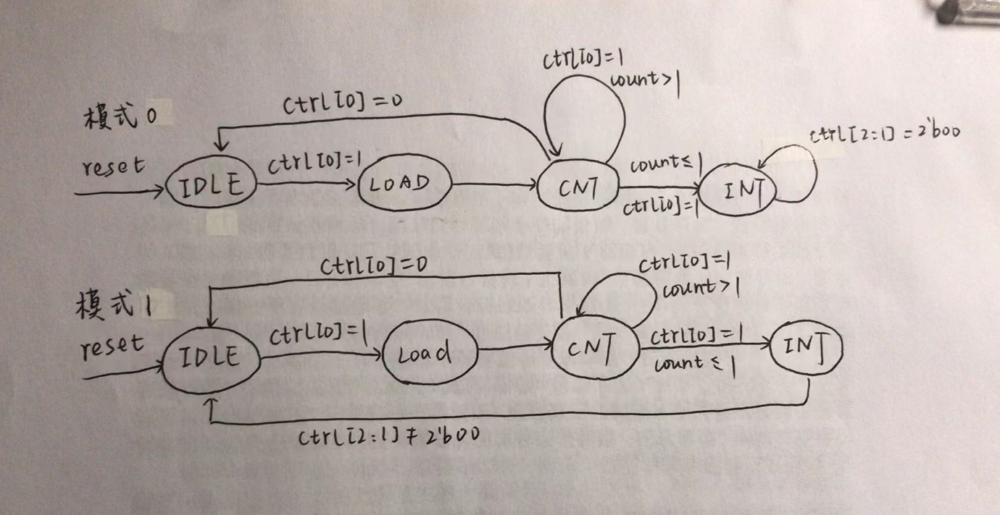

# P7 MIPS 微系统设计文档


## 一、中断和异常 

**中断**和**异常**的处理在我看来是整个 P7 设计中最重要和复杂的任务。这一部分主要帮助我理清这些设计思路。

### 1.1 内部异常

内部异常主要指的是因为流水线 CPU 执行指令时出现不合规范的情况，在发现指令异常时，我们需要将异常的信息告诉协处理器 CP0。这里涉及到需要把这个处理器放在哪一级的问题。这没有最好的答案，**依我个人来看，放在 M 级比较合适，主要是因为所有类型的指令异常都会在 M 级确定，M 级流水寄存器已经完成对所有异常的响应**。当然放在 M 级也产生其他问题，我们这里先不讨论。

我们总结所有可能产生内部异常的情况，见下表。

|流水线级|异常类型|检测部件|异常原因|涉及指令|处理方式|
|---|---|---|---|---|---|
|Fetch|AdEL|IFU|PC未对齐，超出范围|ALL|**置 ExcCode 00100**；修改 instr记为nop|
|Decode|RI|CU|出现无法识别的指令|---|**置 ExcCode 01010**；修改 instr 记为nop|
|Decode|Syscall|CU|系统调用|syscall|**置 ExcCode 01000**；修改 instr 记为 nop|
|Execute|Ov|ALU|计算类指令溢出|add, addi, sub|**置 ExcCode 01100**；清除 GRF 写使能|
|Execute|AdEL|ALU|取数地址溢出|load 类指令|**置 ExcCode 00100**；清零 GRF 写使能|
|Execute|AdES|ALU|存数地址溢出|store 类指令|**置 ExcCode 00101**；清零 DM 写使能信号|
|Memory|AdEL|DM_CU|取数地址未对齐、非法取数|load 类指令|**置 ExcCode 00100**；清零 GRF 写使能|
|Memory|AdES|DM_CU|存数地址未对齐、非法存数|store 类指令|**置 ExcCode 00101**；清零 DM 字节使能信号|

处理内部异常的做法首先是要**保证宏观 PC 以及延迟槽标志 BD 不能出错**。比如当 D 级被阻塞时， E 级的气泡 nop 的 PC 应为 D_PC，BD 应为 D_BD。其次要在发现指令异常时**及时做出响应**,保证异常指令及其后面的指令不对微处理器做修改。

这里比较麻烦的是乘除指令，因为大多数指令只能在 M 级以后才对微处理器有修改，而乘除指令在 E 级就有了。虽然乘除指令没有异常的情况，但如果其在异常指令之后，而 M 级刚刚识别出异常时，此时 MDU 开始计算，这种情况就要消除乘除指令的影响。


### 1.2 外部中断

中断是指 CPU 的外设对 CPU 内部发出的请求，此时的宏观 PC 就是中断开始的指令，处理方法同异常。需要注意的是，如果乘除指令流水到 M 级时刚好中断了，课程要求保证不需要再修改 MDU，减少设计难度。

中断优先级高于异常优先级，即当有异常提交至 CP0 寄存器时，若有中断发生，则硬件应先响应中断，并重新执行受害指令及其后续指令；若没有中断发生，则处理异常。


### 1.3 异常码

异常码用于记录异常中断类型，其中由于中断信号直接给到 CP0，所以在 CPU 中可以认为异常码是 0 时表示指令没有内部异常。

一种指令只可能发生一种内部异常，但由于流水线部件中可能会产生新的异常码，因此异常码的优先级是 F > D > E > M。各功能模块产生的异常码都需要经过判断才能用于更新 ExcCode。

这里有个需要关注的问题也是我设计时遇到的一个 bug，即如果 M 级出现异常以后，通过 Req 修改每个流水线寄存器的值（比如 PC 改成 0x4180），这些被修改的指令其实是无效的，仅仅为了维护宏观 PC，也就是说这些指令不应该出现异常，你需要保证这些指令流到 M 级时 ExcCode 是 5'b00000。否则会出现 CP0 写入的 EPC 为 0x4180 的错误

CPU 对中断异常的响应都是将执行一段异常处理程序，最后通过 **eret** 指令返回记录的受害指令继续执行。

<br> 

## 二、模块设计

### 2.1 F 级模块
该级主要包含 IFU 模块。

**IFU**：增强版 PC 模块，直接和 tb 的 IM 交互。

| 端口  | 方向  | 功能  |
|---|---|---|
|clk|input|时钟控制信号|
|reset|input|同步复位信号|
|Req|input|微处理器中断异常请求，用于修正 F_PC|
|F_IFU_EN|input|使能信号，支持阻塞功能|
|F_IFU_PCnext|input[31:0]|下一条指令，来自 NPC 输出，是正常程序执行时产生的下一条指令地址|
|F_PC|output[31:0]|F 级指令地址（此时不考虑 eret 的情况）|
|F_IFU_ExcCode|output[4:0]|IFU 得到的异常码|

为了实现 eret 清空延迟槽操作，须在 CPU 中对该模块的 F_PC 输出依情况修正。

延迟槽判断不放在该模块，是希望完全分离组合逻辑和时序逻辑。


### 2.2 D 级模块
该级包括 EXT、NPC、GRF、CMP 、CU、F_D_REG 模块。

**EXT**：用于进行立即数扩展。

| 端口  | 方向  | 功能  |
|---|---|---|
|D_EXT_imm16|input[15:0]|用于被扩展的16位立即数|
|D_EXTop|input[3:0]|EXT 模块功能选择控制信号： **0000：符号扩展；0001：无符号扩展; 0010: 低位补0；0011：低位补1**|
|D_EXT_imm32|output[31:0]|扩展得到的32位结果|

**CMP**：得到两个源操作数的比较结果。

| 端口  | 方向  | 功能  |
|---|---|---|
|D_CMP_opA|input[31:0]|32位源操作数A|
|D_CMP_opB|input[31:0]|32位源操作数B|
|D_CMPop|input[3:0]|CMP模块功能选择控制信号:**0000：A=?=B; 0001；A<?B有符号; 0010: A>?B有符号;  0011：A<?B无符号; 0100: A>?B无符号; 0101：A!=B？**|
|D_CMP_result|output[31:0]|比较结果|

为了提高 CPU 吞吐率，将比较功能从 ALU 中分离出来，这是**为了实现在 D级就能够判断下一条指令地址**而做的改变。

**GRF**：寄存器文件，存储寄存器数据。

| 端口  | 方向  | 功能  |
|---|---|---|
|clk|input|时钟控制信号|
|reset|input|同步复位信号|
|GRF_write|input|写控制信号，高电平有效|
|GRF_A1|input[4:0]|第一个读寄存器地址|
|GRF_A2|input[4:0]|第二个读寄存器地址|
|GRF_A3|input[4:0]|写寄存器的地址|
|GRF_WD|input[31:0]|写寄存器的32位数据|
|GRF_RD1|output[31:0]|第一个读寄存器的数据|
|GRF_RD2|output[31:0]|第二个读寄存器的数据|

在 GRF 中，**支持内部转发**，即在模块内自行判断 A3 和 A1， A2 相同的情况。

**NPC**：根据指令译码结果，计算下一条进入流水线的指令地址。

  | 端口  | 方向  | 功能  |
  |---|---|---|
  |D_NPC_PC|input[31:0]|NPC 模块计算的基地址|
  |D_NPCop|input[3:0]|NPC 模块功能控制信号：**0000：PC+4； 0001： PC+4+signed[imm16]+00; 0010: PC[31:28]+imm26+00; 0011：regdata; 0100: EPC**|
  |D_NPC_imm16|input[15:0]|指令16位立即数|
  |D_NPC_imm26|input[25:0]|指令26位立即数|
  |D_CMP_result|input[31:0]|CMP 的比结果|
  |D_NPC_RegData|input[31:0]|寄存器存储的跳转地址|
  |D_NPC_EPC|input[31:0]|经过转发后得到的EPC值|
  |D_NPC_PCnext|output[31:0]|计算得到的新PC|

**F_D_REG**：F 到 D级流水线寄存器。

| 端口  | 方向  | 功能  |
|---|---|---|
|clk|input|时钟控制信号|
|reset|input|高电平有效，同步复位信号，用于清空寄存器|
|Req|input|微处理器异常处理请求 |
|F_D_GRF_EN|input|高电平有效，寄存器使能信号|
|F_BD|input|F 级指令的延迟槽标志|
|F_ExcCode|input[4:0]|F 级指令异常码|
|F_PC|input[31:0]|F 级的指令地址|
|F_instr|input[31:0]|F 级的指令机器码|
|D_BD|output|D 级指令的延迟槽标志|
|D_PC|output[31:0]|D 级的指令地址|
|D_instr|output[31:0]|D 级的指令机器码|
|D_ExcCode|output[4:0]|D 级指令异常码|

注意流水线寄存器流出的异常码需要在该级做进一步修正，并非最终结果，这里仅为命名方便

**CU**：集中式译码，产生指令流水过程的各种控制信号，不包括冲突控制信号。

| 端口  | 方向  | 功能  |
|---|---|---|
|D_CU_opcode|input[5:0]|指令的opcode字段|
|D_CU_func|input[5:0]|指令|
|D_EXTop|output[3:0]|D 级指令产生的 EXT 控制信号：**0000：符号扩展；0001：无符号扩展; 0010: 低位补0；0011：低位补1**|
|D_NPCop|output[3:0]|D 级指令产生的 NPC 控制信号：**0000：PC+4； 0001： PC+4+signed[imm16]+00; 0010: PC[31:28]+imm26+00; 0011：regdata; 0100: EPC**|
|D_CMPop|output[3:0]|D 级指令产生的 CMP 控制信号：**0000：A=?=B; 0001；A<?B有符号; 0010: A>?B有符号;  0011：A<?B无符号; 0100: A>?B无符号; 0101：A!=B？**|
|D_GRF_write|output|D 级指令产生的寄存器写信号|
|D_ALUop|output[4:0]|D 级指令产生的 ALU 控制信号: **00000：A+B； 00001：A-B； 00010：A或B； 00011：A与B； 00100：B逻辑右移C; 00101: B逻辑左移C; 00110: B算数右移C; 00111；A<?B有符号; 01000: A>?B有符号;  01001：A<?B无符号; 01010: A>?B无符号**|
|D_DM_write|output|D 级指令产生的 DM 写信号|
|D_GRF_DatatoReg|output[3:0]|D 级指令写入寄存器的数据选择信号：**0000：ALUout;  0001：DMout; 0010：PC+8; 0011：写入CMPresult; 0100：MDUout; 0101：CP0out**|
|D_GRF_A3_sel|output[2:0]|D 级指令目的寄存器选择控制信号：**000：rd；001：rt；010：31号寄存器**|
|D_ALU_Bsel|output[2:0]|D 级指令产生的 ALU B端口数据选择信号：**000：RD2 001：扩展后的32位立即数**|
|D_rs_Tuse|output[3:0]|D 级指令rs段对应的寄存器使用所需时间|
|D_rt_Tuse|output[3:0]|D 级指令rt段对应的寄存器使用所需时间|
|D_Tnew|output[3:0]|D 级指令产生写入寄存器的数据所需时间|
|D_DMop|output[1:0]|D 级指令产生的 DM 控制信号：**W(00)、H(01)、B(10)**|
|D_BEop|output[2:0]|D 级指令产生的 BE 控制信号：**000：无扩展；001：无符号字节数据扩展；010：符号字节数据扩展；011：无符号半字数据扩展；100：符号半字数据扩展**|
|D_MDU_start|output|D 级指令的 MDU 开始工作信号|
|D_MDUop|output[3:0]|D 级指令的 MDU 功能选择信号：**0000：无操作；0001：符号乘 A*B；0010：无符号乘 A*B；0011：符号除 A/B； 0100：无符号除 A/B；0101：写 HI 寄存器；0110：写 LO 寄存器**|
|D_MDUout_sel|output|D 级指令 MDU 输出结果选择信号：**0：HI 寄存器；1：LO 寄存器**|
|D_CP0_write|output|D 级指令 CP0 写使能信号|
|D_instr_type|output[3:0]|指令类型，用于异常码判断 **0000：不会发生异常指令；0001：计算类指令，可能发生Ov；0010：store类指令，可能发生 AdEs 异常；0011：load类指令，可能发生 AdEL 异常；0100：跳转指令，判断 F 级是否为延迟槽**|
|D_eret|output|D 级指令是否为 eret|
|D_CU_ExcCode|output[4:0]|CU 译码出指令的异常码，可能是 **Syscall** 或 **RI**|

由于采用无脑转发的冒险解决方式，如果某一个字段的寄存器不被用到，那么其 Tuse 设置为 7，避免被 AT 法误判产生阻塞信号。


### 2.3 E 级模块

该级主要包括 ALU、D_E_REG、MDU 模块。

**ALU**：有计算功能的模块。

| 端口  | 方向  | 功能  |
|---|---|---|
|E_ALU_opA|input[31:0]|ALU 模块的第一个操作数|
|E_ALU_opB|input[31:0]|ALU 模块的第二个操作数|
|E_ALU_opC|input[4:0]|ALU 模块的第三个操作数，对应 R 型指令的shamt 字段|
|E_ALUop|input[4:0]|ALU 功能选择控制信号: **00000：A+B； 00001：A-B； 00010：A或B； 00011：A与B； 00100：B逻辑右移C; 00101: B逻辑左移C; 00110: B算数右移C**|
|E_instr_type|input[3:0]|E 级指令的类型，用于判定异常码|
|E_ALU_result|output[31:0]|32位计算结果|
|E_ALU_ExcCode|output[4:0]|ALU 部件得到的异常码|


**D_E_REG**：D 到 E级流水线寄存器。

| 端口  | 方向  | 功能  |
|---|---|---|
|clk|input|时钟控制信号|
|reset|input|高电平有效，同步复位信号，用于清空寄存器|
|Req|input|中断异常请求信号|
|flush|input|阻塞时的清空信号，优先级最低|
|D_E_GRF_EN|input|高电平有效，使能信号|
|D_PC|input[31:0]|D 级的指令地址|
|D_instr|input[31:0]|D 级的指令机器码|
|D_ALUop|input[4:0]|D 级指令产生的 ALU 控制信号|
|D_DM_write|input|D 级指令产生的 DM 写信号|
|D_CP0_write|input|D 级指令的 CP0 写使能信号|
|D_GRF_write|input|D 级指令产生的 GRF 写信号|
|D_RD1|input[31:0]|从寄存器读出的第一个数据，已经过一次转发|
|D_RD2|input[31:0]|从寄存器读出的第二个数据，已经过一次转发|
|D_instr_shamt|input[4:0]|D 级指令 shamt 段数据|
|D_EXT_imm32|input[31:0]|D 级 EXT 扩展的32位立即数|
|D_GRF_A3|input[4:0]|D 级指令的目的寄存器地址|
|D_CMP_result|input[31:0]|D 级指令 CMP 比较结果|
|D_GRF_DatatoReg|input[3:0]|D 级指令写入寄存器的数据选择信号|
|D_ALU_Bsel|input[2:0]|D 级指令产生的 ALU B端口数据选择信号|
|D_DMop|input[1:0]|D 级指令的 DM 控制信号|
|D_MDU_start|input|D 级指令的 MDU 开始信号|
|D_MDUop|input[3:0]|D 级指令的 MDU 功能选择信号|
|D_MDUout_sel|input|D 级指令 MDU 输出结果选择信号|
|D_BEop|input[2:0]|D 级指令产生的 BE 控制信号|
|D_rs_Tuse|input[3:0]|D 级指令rs段对应的寄存器使用所需时间|
|D_rt_Tuse|input[3:0]|D 级指令rt段对应的寄存器使用所需时间|
|D_Tnew|input[3:0]|D 级指令得到写入寄存器的数据所需时间|
|D_BD|input|D 级指令的延迟槽标志|
|D_eret|input|D 级指令eret标记|
|D_ExcCode|input[4:0]|D 级指令的异常码|
|D_instr_type|input[3:0]|D 级指令的类型|
|E_RD1|output[31:0]|从 D 级流水至 E 级的第一个寄存器数据|
|E_RD2|output[31:0]|从 D 级流水至 E 级的第二个寄存器数据|
|E_instr_shamt|output[4:0]|E 级指令 shamt 段数据|
|E_EXT_imm32|output[31:0]|从 D 级流水至 E 级的扩展后的32位立即数|
|E_GRF_A3|output[4:0]|E 级指令的目的寄存器地址|
|E_PC|output[31:0]|E 级的指令地址|
|E_instr|output[31:0]|E 级的指令机器码|
|E_ALUop|output[31:0]|E 级指令产生的 ALU 控制信号|
|E_DM_write|output|E 级指令产生的 DM 写信号|
|E_GRF_write|output|E 级指令产生的 GRF 写信号|
|E_CP0_write|output|E 级指令的 CP0 写信号|
|E_CMP_result|output[31:0]|E 级指令 CMP 比较结果|
|E_GRF_DatatoReg|output[3:0]|E 级指令写入寄存器的数据选择信号|
|E_ALU_Bsel|output[2:0]|E 级指令产生的 ALU B端口数据选择信号|
|E_MDU_start|output|E 级指令的 MDU 开始信号|
|E_MDUop|output[3:0]|E 级指令的 MDU 功能选择信号|
|E_MDUout_sel|output|E 级指令 MDU 输出结果选择信号|
|E_BEop|output[2:0]|E 级指令产生的 BE 控制信号|
|E_DMop|output[1:0]|E 级指令的 DM 控制信号|
|E_BD|output|E 级指令的延迟槽标志|
|E_eret|output|E 级指令eret标记|
|E_ExcCode|output[4:0]|E 级指令的异常码|
|E_instr_type|output[3:0]|E 级指令的类型|
|E_rs_Tuse|output[3:0]|E 级指令rs段对应的寄存器使用所需时间|
|E_rt_Tuse|output[3:0]|E 级指令rt段对应的寄存器使用所需时间|
|E_Tnew|output[3:0]|E 级指令产生写入寄存器的数据所需时间|


**MDU**：乘除模块。

| 端口  | 方向  | 功能  |
|---|---|---|
|clk|input|时钟控制信号|
|reset|input|同步复位信号|
|start|input|表示 MDU 即将工作的信号，维持一周期|
|Req|input|中断异常请求|
|E_MDU_opA|input[31:0]|MDU 模块第一个操作数|
|E_MDU_opB|input[31:0]|MDU 模块第二个操作数|
|E_MDUop|input[3:0]|MDU 功能选择信号：**0000：无操作；0001：符号乘 A*B；0010：无符号乘 A*B；0011：符号除 A/B； 0100：无符号除 A/B；0101：写 HI 寄存器；0110：写 LO 寄存器**|
|busy|output|MDU 工作信号，高位表示正在使用|
|HI|output[31:0]|HI 寄存器的数据|
|LO|output[31:0]|LO 寄存器的数据|

乘除模块只会阻塞需要用到该模块的指令即 MULT、 MULTU、 DIV、 DIVU、MFHI、MFLO、MTHI、MTLO，其他指令可以从 D 级流水至 E 级，这就要求增加 HCU 的功能。


### 2.4 M 级模块
该级主要包括 DM、E_M_REG、DM_CU、BE、CP0 模块。

**DM**：数据存储器。

| 端口  | 方向  | 功能  |
|---|---|---|
|m_inst_addr|input[31:0]|M 级 PC|
|m_data_byteen|input[3:0]|数据存储器功能选择信号，具体见下表|
|m_data_addr|input[31:0]|待写入/读出的数据存储器相应地址|
|m_data_wdata|input[31:0]|待写入数据存储器相应数据|
|m_data_rdata|output[31:0]|数据存储器存储的相应数据|

|byteen|功能|
|:--|:--|
|1111|**m_data_wdata[31:24]** 写入 **byte3**；**m_data_wdata[23:16]** 写入 **byte2**；**m_data_wdata[15:8]** 写入 **byte1**；**m_data_wdata[7:0]** 写入 **byte0**|
|0011|**m_data_wdata[15:8]** 写入 **byte1**；**m_data_wdata[7:0]** 写入 **byte0**|
|1100|**m_data_wdata[31:24]** 写入 **byte3**；**m_data_wdata[23:16]** 写入 **byte2**|
|0001| **m_data_wdata[7:0]** 写入 **byte0**|
|0010| **m_data_wdata[15:8]** 写入 **byte1**|
|0100| **m_data_wdata[23:16]** 写入 **byte2**|
|1000| **m_data_wdata[31:24]** 写入 **byte3**|

P7 实验中该模块已外置。

**DM_CU**：DM 控制信号译码器。

| 端口  | 方向  | 功能  |
|---|---|---|
|M_DM_write|input|数据存储器写使能信号|
|M_instr_type|input[3:0]|M 级指令的类型|
|M_RD2_new|input[31:0]|M 级转发后的 RD2|
|M_ALUout|input[31:0]|M 级指令产生的 ALU 计算结果|
|M_DMop|input[1:0]|M 级指令的 DM 控制信号,用于判断字，半字，字节指令|
|M_byteen|output[3:0]|四位字节使能|
|M_DM_WD|output[31:0]|经过处理的 DM 写数据，主要是配合DM规格的使用|
|M_DM_CU_ExcCode|ouput[4:0]|DM_CU 得到的指令异常码|


**BE**：数据存储器的数据扩展模块。

| 端口  | 方向  | 功能  |
|---|---|---|
|M_BE_addr|input[31:0]|从数据存储器读出的数据地址，连接ALUout|
|M_BE_in|input[31:0]|从数据存储器读出的数据|
|M_BEop|input[2:0]|BE 模块功能选择信号：**000：无扩展；001：无符号字节数据扩展；010：符号字节数据扩展；011：无符号半字数据扩展；100：符号半字数据扩展**|
|M_BEout|output[31:0]|扩展得到的32位数据，连接 M_DMout|


**E_M_REG**：E 到 M级流水线寄存器。

| 端口  | 方向  | 功能  |
|---|---|---|
|clk|input|时钟控制信号|
|reset|input|同步复位信号，高电平有效|
|Req|input|中断异常请求信号|
|E_M_REG_EN|input|高电平有效，使能信号|
|E_PC|input[31:0]|E 级指令的地址|
|E_instr|input[31:0]|E 级指令的32位机器码|
|E_RD2|input[31:0]|E 级指令读出的第二个寄存器数据|
|E_DM_write|input|E 级指令的 DM 写控制信号|
|E_CP0_write|input|E 级指令的 CP0 写信号|
|E_DMop|input[1:0]|E 级指令的 DM 控制信号|
|E_BEop|input[2:0]|E 级指令产生的 BE 控制信号|
|E_MDUout|input[31:0]|E 级指令的MDU计算结果|
|E_ALUout|input[31:0]|E 级指令的 ALU 计算结果|
|E_GRF_A3|input[4:0]|E 级指令的目的寄存器|
|E_GRF_write|input|E 级指令的寄存器堆写信号|
|E_GRF_DatatoReg|input[3:0]|E 级指令写入寄存器的数据选择信号|
|E_CMP_result|input[31:0]|E 级指令 CMP 比较结果|
|E_BD|input|E 级指令的延迟槽标志|
|E_eret|input|E 级指令eret标记|
|E_instr_type|input[3:0]|E 级指令类型|
|E_ExcCode|input[4:0]|E 级指令的异常码|
|E_rs_Tuse|input[3:0]|E 级指令rs段对应的寄存器使用所需时间|
|E_rt_Tuse|input[3:0]|E 级指令rt段对应的寄存器使用所需时间|
|E_Tnew|input[3:0]|E 级指令产生写入寄存器的数据所需时间|
|M_PC|output[31:0]|M 级指令的地址|
|M_instr|output[31:0]|M 级指令的32位机器码|
|M_RD2|output[31:0]|M 级指令读出的第二个寄存器数据|
|M_ALUout|output[31:0]|M 级指令的 ALU 计算结果|
|M_DM_write|output|M 级指令的 DM 写控制信号|
|M_DMop|output[1:0]|M 级指令的 DM 控制信号|
|M_BEop|output[2:0]|M 级指令产生的 BE 控制信号|
|M_MDUout|output[31:0]|M 级指令的MDU计算结果|
|M_GRF_A3|output[4:0]|M 级指令的目的寄存器|
|M_GRF_write|output|M 级指令的寄存器堆写信号|
|M_CP0_write|output|M 级指令的 CP0 写信号|
|M_GRF_DatatoReg|output[3:0]|M 级指令写入寄存器的数据选择信号|
|M_CMP_result|output[31:0]|M 级指令 CMP 比较结果|
|M_BD|output|M 级指令的延迟槽标志|
|M_eret|output|M 级指令eret标记 |
|M_instr_type|output[3:0]|M 级指令类型|
|M_ExcCode|output[4:0]|M 级指令的异常码|
|M_rs_Tuse|output[3:0]|M 级指令rs段对应的寄存器使用所需时间|
|M_rt_Tuse|output[3:0]|M 级指令rt段对应的寄存器使用所需时间|
|M_Tnew|output[3:0]|M 级指令产生写入寄存器的数据所需时间|

**CP0**：中断异常协处理器。

| 端口  | 方向  | 功能  |
|---|---|---|
|clk|input|时钟控制信号|
|reset|input|复位信号|
|CP0_write|input|写使能信号|
|CP0_addr|input[4:0]|CP0寄存器地址|
|CP0_in|input[31:0]|CP0的写入数据|
|EPC_in|input[31:0]|受害指令地址|
|BD_in|input|标记受害指令是否是延迟槽指令|
|ExcCodeIn|input[4:0]|记录中断异常类型|
|HWInt|input[5:0]|中断信号|
|EXL_clr|input|EXL 复位信号|
|CP0_out|output[31:0]|CP0 读出数据|
|EPC_out|output[31:0]|返回的 EPC |
|Req|output|中断处理信号|


### 2.5 W 级模块

该级主要包括 GRF、M_W_REG 模块。

**M_W_REG**：M 到 W 级流水线寄存器。

| 端口  | 方向  | 功能  |
|---|---|---|
|clk|input|时钟控制信号|
|reset|input|同步复位信号，高电平有效|
|Req|input|中断异常信号|
|M_W_REG_EN|input|高电平有效，使能信号|
|M_PC|input[31:0]|M 级指令的地址|
|M_instr|input[31:0]|M 级指令的32位机器码|
|M_ALUout|input[31:0]|M 级指令的 ALU 计算结果|
|M_GRF_A3|input[4:0]|M 级指令的目的寄存器|
|M_DMout|input[31:0]|M 级指令从 DM 读出的数据|
|M_GRF_write|input|M 级指令的寄存器堆写控制信号|
|M_GRF_DatatoReg|input[3:0]|M 级指令写入寄存器的数据选择信号|
|M_CMP_result|input[31:0]|M 级指令 CMP 比较结果|
|M_MDUout|input[31:0]|M 级指令的MDU计算结果|
|M_CP0_EPC|input[31:0]|M 级指令 CP0 的 EPC 寄存器输出|
|M_CP0out|input[31:0]|M 级指令 CP0 读出的寄存器数据|
|M_rs_Tuse|input[3:0]|M 级指令rs段对应的寄存器使用所需时间|
|M_rt_Tuse|input[3:0]|M 级指令rt段对应的寄存器使用所需时间|
|M_Tnew|input[3:0]|M 级指令产生写入寄存器的数据所需时间|
|W_PC|output[31:0]|W 级指令的地址|
|W_instr|output[31:0]|W 级指令的32位机器码|
|W_GRF_write|output|W 级指令的寄存器堆写控制信号|
|W_GRF_A3|output[4:0]|W 级指令的目的寄存器|
|W_GRF_DatatoReg|output[3:0]|W 级指令写入寄存器的数据选择信号|
|W_ALUout|output[31:0]|W 级指令的 ALU 计算结果|
|W_DMout|output[31:0]|W 级指令从 DM 读出的数据|
|W_MDUout|output[31:0]|W 级指令的MDU计算结果|
|W_CMP_result|output[31:0]|W 级指令 CMP 比较结果|
|W_CP0_EPC|output[31:0]|W 级指令 CP0 的 EPC 寄存器输出|
|W_CP0out|output[31:0]|W 级指令 CP0 读出的寄存器数据|
|W_rs_Tuse|output[3:0]|W 级指令rs段对应的寄存器使用所需时间|
|W_rt_Tuse|output[3:0]|W 级指令rt段对应的寄存器使用所需时间|
|W_Tnew|output[3:0]|W 级指令产生写入寄存器的数据所需时间|

**HCU**：冒险（hazard）控制单元，在下一部分重点分析。

<br> 


## 三、冒险控制单元设计

在流水线 CPU 中最大最重要的问题就是冒险问题。为了解决这一问题，我专门设置了一个冒险控制单元，产生冒险控制信号。在我的设计中，冒险控制单元的逻辑基于 **AT 法**，属于无脑转发的方式，同时，为了处理乘除指令的冲突，还需要根据 busy，start信号以及对 mflo，mfhi 作特判。接下来从几个问题的回答来辅助设计冒险控制单元。

在流水线 CPU 中冒险的种类可以细分为：

* **结构冒险**：在 CO 实验体系结构中，结构冒险指寄存器文件需要在 D 级和 W 级同时被使用（读写）时并且读和写的寄存器为同一个寄存器时。本质还是一种数据冒险，我们采用 GRF 内部转发解决。
* **控制冒险**：指分支指令（如 beq ）的判断结果会影响接下来指令的执行流的情况。在判断结果产生之前，我们无法预测分支是否会发生。然而，此时流水线还会继续取指，让后续指令进入流水线。这时就有可能导致错误的产生，即不该被执行的指令进入到了指令的执行流中。课程选择了延迟槽来解决这一冒险。
* **数据冒险**：流水线之所以会产生数据冒险，就是因为后面指令需求的数据，正好就是前面指令供给的数据，而后面指令在需要使用数据时，前面供给的数据还没有存入寄存器堆，从而导致后面的指令不能正常地读取到正确的数据，这也是我们重点需要关注的冒险种类。

冒险的解决方案：

* **转发**：简而言之，转发就是前方流水中已经得到结果而当前阶段有需要，不等该结果写回寄存器而直接重定向到当前阶段，提高吞吐率。不难发现，需要转发的地方是需要寄存器数据的地方，主要在于 D 级和 E 级。能够提供转发数据的地方主在 E 级，M 级和 W 级。
* **阻塞**：阻塞是指当发生数据依赖时，只让前一条指令执行，而后一条指令被阻塞在流水线的某个阶段，并不向下执行，等待前一条指令执行完成（或者执行到没有冲突的时候），再解除后一条的阻塞状态。显然阻塞降低 CPU 的性能，所以只在必要时刻才阻塞。

什么时候转发和阻塞：

* **转发的需求者**应该在当前阶段需要用到寄存器的数据，有 D 级（CMP，NPC）、E 级（ALU）、E 级（DM）。
* **转发的供给者**应当在当前阶段的流水线寄存器中保存了会写入寄存器堆的数据。（*注意，本实验要求解决数据冒险而设计的转发数据来源必须是某级流水线寄存器，不允许对功能部件的输出直接进行转发。*）
* 可能写入寄存器堆的数据有 **E_CMP_result、E_PC+8、M_PC+8、M_ALUout、M_CMP_result、M_MDUout、W_PC+8、W_ALUout、W_DMout、W_CMP_result、W_MUDout、W_CP0out**。
* 当前指令的所在阶段的 Tuse >= 之后流水线中指令的 Tnew 时，可以继续流水，反之则必须阻塞（实验要求阻塞必须在 D级）。这也意味着我们必须对处在 D 级的指令做好判断，如果阻塞，需要同时清空 E 级流水线寄存器（插入一个气泡）。

至此，我们就可以进行模块的设计：

  | 端口  | 方向  | 功能  |
  |---|---|---|
  |D_instr|input[31:0]|用于解析 D 级指令的两个源寄存器编号 rs rt|
  |D_rs_Tuse|input[3:0]|D 级指令 rs 寄存器使用时钟周期|
  |D_rt_Tuse|input[3:0]|D 级指令 rt 寄存器使用时钟周期|
  |E_instr|input[31:0]|用于解析 E 级指令的两个源寄存器编号 rs rt|
  |E_rs_Tuse|input[3:0]|E 级指令 rs 寄存器使用时钟周期|
  |E_rt_Tuse|input[3:0]|E 级指令 rt 寄存器使用时钟周期|
  |E_Tnew|input[3:0]|E 级指令产生写入结果的时钟周期|
  |M_instr|input[31:0]|用于解析 M 级指令的一 个源寄存器编号 rt|
  |M_rt_Tuse|input[3:0]|M 级指令 rt 寄存器使用时钟周期|
  |M_Tnew|input[3:0]|M 级指令产生写入结果的时钟周期|
  |W_Tnew|input[3:0]|W 级指令产生写入结果的时钟周期|
  |E_GRF_A3|input[4:0]|E 级指令的目的寄存器|
  |E_GRF_write|input|用于判断 E 级指令是否为写寄存器指令|
  |E_GRF_DatatoReg|input[3:0]|E 级指令写入寄存器的数据选择信号:**0000：ALUout;  0001：DMout; 0010：PC+8; 0011：写入CMPresult; 0100：MDUout；0101：CP0out**|
  |M_GRF_A3|input[4:0]|M 级指令的目的寄存器|
  |M_GRF_write|input|用于判断 M 级指令是否为写寄存器指令|
  |M_GRF_DatatoReg|input[3:0]|M 级指令写入寄存器的数据选择信号:**0000：ALUout;  0001：DMout; 0010：PC+8; 0011：写入CMPresult; 0100：MDUout；0101：CP0out**|
  |W_GRF_A3|input[4:0]|W 级指令的目的寄存器|
  |W_GRF_write|input|用于判断 W 级指令是否为写寄存器指令|
  |W_GRF_DatatoReg|input[3:0]|W 级指令写入寄存器的数据选择信号:**0000：ALUout;  0001：DMout; 0010：PC+8; 0011：写入CMPresult; 0100：MDUout；0101：CP0out**|
  |E_busy|input|E 级指令的 MDU 使用信号|
  |E_start|input|E 级指令的 MDU 开始使用信号|
  |D_start|input|D 级指令的 MDU 开始使用信号|
  |stall|output|阻塞信号，高电平有效，如果阻塞，则 stall 接到D_E_REG复位端，取反接到 PC 使能端，F_D_REG 使能端|
  |D_FW_EPC_sel|output[2:0]|D 级的 NPC 的 EPC 选择转发信号: **000 :W_CP0_EPC; 001: M_RD2; 010: E_RD2**|
  |D_FW_rs_sel|output[4:0]|D 级指令 rs 端寄存器转发选择信号:**00000: keep; 00001: E_PC+8; 00010: E_CMP_result; 00011: M_PC+8; 00100: M_ALUout; 00101: M_CMP_result; 00110: M_MDUout**|
  |D_FW_rt_sel|output[4:0]|D 级指令 rt 端寄存器转发选择信号:**00000: keep; 00001: E_PC+8; 00010: E_CMP_result; 00011: M_PC+8、00100: M_ALUout; 00101: M_CMP_result; 00110: M_MDUout**|
  |E_FW_rs_sel|output[4:0]|E 级指令 rs 端寄存器转发选择信号:**00000: keep; 00001: M_ALUout; 00010: M_PC+8; 00011: M_CMP_result; 00100: M_MDUout; 00101: W_ALUout; 00110: W_DMout; 00111: W_PC+8; 01000: W_CMP_result; 01001: W_MDUout; 01010: W_CP0out**|
  |E_FW_rt_sel|output[4:0]|E 级指令 rt 端寄存器转发选择信号:**00000: keep; 00001: M_ALUout; 00010: M_PC+8; 00011: M_CMP_result; 00100: M_MDUout; 00101: W_ALUout; 00110: W_DMout; 00111: W_PC+8; 01000: W_CMP_result; 01001: W_MDUout; 01010: W_CP0out**|
  |M_FW_rt_sel|output[4:0]|M 级指令 rt 端寄存器转发选择信号: **00000: keep; 00001: W_ALUout; 00010: W_DMout; 00011: W_PC+8; 00100: W_CMP_result; 00101: W_MDUout; 00110: W_CP0out**|
  |E_flush|output|E 级流水线寄存器的清空信号|

<br> 

## 四、指令实现

**ori 指令**：

功能描述 : GPR[rt] <- GPR[rs] OR unsignedextend(immediate)

|op|CP0_write|GRF_write|DM_write|GRF_A3sel[2:0]|DatatoReg[3:0]|EXTop[3:0]|ALUop[4:0]|DMop[1:0]|BEop[2:0]|MDUop[3:0]|NPCop[3:0]|CMPop[3:0]|ALU_Bsel[2:0]|MDUout_sel|MDU_start|rs_Tuse[3:0]|rt_Tuse[3:0]|Tnew[3:0]|
|---|---|---|---|---|---|---|---|---|---|---|---|---|---|---|---|---|---|---|
|001101|0|1|0|001|0000|0001|00010|00|000|0000|0000|0000|001|X|0|4'd1|4'd7|4'd2|

**lui 指令**：

功能描述：GPR[rt] <- immediate||16'd0

|op|CP0_write|GRF_write|DM_write|GRF_A3sel[2:0]|DatatoReg[3:0]|EXTop[3:0]|ALUop[4:0]|DMop[1:0]|BEop[2:0]|MDUop[3:0]|NPCop[3:0]|CMPop[3:0]|ALU_Bsel[2:0]|MDUout_sel|MDU_start|rs_Tuse[3:0]|rt_Tuse[3:0]|Tnew[3:0]|
|---|---|---|---|---|---|---|---|---|---|---|---|---|---|---|---|---|---|---|
|001111|0|1|0|001|0000|0010|00000|00|000|0000|0000|XXXX|001|0|0|4'd1|4'd7|4'd2|


**jal 指令**：

功能描述：PC <- (PC[31:28] || instr_immediate || 00); GPR[31] <- PC + 4

|op|GRF_write|DM_write|GRF_A3sel[2:0]|DatatoReg[3:0]|EXTop[3:0]|ALUop[4:0]|DMop[1:0]|BEop[2:0]|MDUop[3:0]|NPCop[3:0]|CMPop[3:0]|ALU_Bsel[2:0]|MDUout_sel|MDU_start|rs_Tuse[3:0]|rt_Tuse[3:0]|Tnew[3:0]|
|---|---|---|---|---|---|---|---|---|---|---|---|---|---|---|---|---|---|
|000011|1|0|010|0010|XXXX|XXXXX|00|000|0000|0010|XXXX|000|0|0|4'd7|4'd7|4'd1|

**jr 指令**：

功能描述：PC <- GPR[rs]

|op|func|GRF_write|DM_write|GRF_A3sel[2:0]|DatatoReg[3:0]|EXTop[3:0]|ALUop[4:0]|DMop[1:0]|BEop[2:0]|MDUop[3:0]|NPCop[3:0]|CMPop[3:0]|ALU_Bsel[2:0]|MDUout_sel|MDU_start|rs_Tuse[3:0]|rt_Tuse[3:0]|Tnew[3:0]|
|---|---|---|---|---|---|---|---|---|---|---|---|---|---|---|---|---|---|---|
|000000|001000|0|0|XXX|XXXX|XXXX|XXXXX|00|000|0000|0011|XXXX|000|0|0|4'd0|4'd7|4'd0|

**add 指令**：
  功能描述：GPR[rd] <- GPR[rs]+GPR[rt]

|op|func|GRF_write|DM_write|GRF_A3sel[2:0]|DatatoReg[3:0]|EXTop[3:0]|ALUop[4:0]|DMop[1:0]|BEop[2:0]|MDUop[3:0]|NPCop[3:0]|CMPop[3:0]|ALU_Bsel[2:0]|MDUout_sel|MDU_start|rs_Tuse[3:0]|rt_Tuse[3:0]|Tnew[3:0]|
|---|---|---|---|---|---|---|---|---|---|---|---|---|---|---|---|---|---|---|
|000000|100000|1|0|000|0000|XXXX|00000|00|000|0000|0000|XXXX|000|0|0|4'd1|4'd1|4'd2|

**sub 指令**：

功能描述 GPR[rd] <- GPR[rs] - GPR[rt]

|op|func|GRF_write|DM_write|GRF_A3sel[2:0]|DatatoReg[3:0]|EXTop[3:0]|ALUop[4:0]|DMop[1:0]|BEop[2:0]|MDUop[3:0]|NPCop[3:0]|CMPop[3:0]|ALU_Bsel[2:0]|MDUout_sel|MDU_start|rs_Tuse[3:0]|rt_Tuse[3:0]|Tnew[3:0]|
|---|---|---|---|---|---|---|---|---|---|---|---|---|---|---|---|---|---|---|
|000000|100010|1|0|000|0000|XXXX|00001|00|000|0000|0000|XXXX|000|0|0|4'd1|4'd1|4'd2|


**beq 指令**：

功能描述：if (GPR[rs] == GPR[rt]) PC <- PC + 4 + sign_extend(offset||00) else PC <- PC + 4

|op|GRF_write|DM_write|GRF_A3sel[2:0]|DatatoReg[3:0]|EXTop[3:0]|ALUop[4:0]|DMop[1:0]|BEop[2:0]|MDUop[3:0]|NPCop[3:0]|CMPop[3:0]|ALU_Bsel[2:0]|MDUout_sel|MDU_start|rs_Tuse[3:0]|rt_Tuse[3:0]|Tnew[3:0]|
|---|---|---|---|---|---|---|---|---|---|---|---|---|---|---|---|---|---|
|000100|0|0|XXX|XXXX|XXXX|XXXXX|00|000|0000|0001|0000|XXX|0|0|4'd0|4'd0|4'd0|

**lw 指令**：

功能描述：GPR[rt] <= memory[GPR[rs]+offset]

|op|GRF_write|DM_write|GRF_A3sel[2:0]|DatatoReg[3:0]|EXTop[3:0]|ALUop[4:0]|DMop[1:0]|BEop[2:0]|MDUop[3:0]|NPCop[3:0]|CMPop[3:0]|ALU_Bsel[2:0]|MDUout_sel|MDU_start|rs_Tuse[3:0]|rt_Tuse[3:0]|Tnew[3:0]|
|---|---|---|---|---|---|---|---|---|---|---|---|---|---|---|---|---|---|
|100011|1|0|001|0001|0000|00000|00|000|0000|0000|0000|001|0|0|4'd1|4'd7|4'd3|

**sw 指令**：

功能描述：memory[GPR[rs]+offset] <- GPR[rt]

|op|GRF_write|DM_write|GRF_A3sel[2:0]|DatatoReg[3:0]|EXTop[3:0]|ALUop[4:0]|DMop[1:0]|BEop[2:0]|MDUop[3:0]|NPCop[3:0]|CMPop[3:0]|ALU_Bsel[2:0]|MDUout_sel|MDU_start|rs_Tuse[3:0]|rt_Tuse[3:0]|Tnew[3:0]|
|---|---|---|---|---|---|---|---|---|---|---|---|---|---|---|---|---|---|
|101011|0|1|XXX|XXXX|0000|00000|00|000|0000|0000|XXXX|001|0|0|4'd1|4'd2|4'd0|


**mult 指令**：

功能描述：(HI, LO) <- GPR[rs]×GPR[rt]

|op|func|GRF_write|DM_write|GRF_A3sel[2:0]|DatatoReg[3:0]|EXTop[3:0]|ALUop[4:0]|DMop[1:0]|BEop[2:0]|MDUop[3:0]|NPCop[3:0]|CMPop[3:0]|ALU_Bsel[2:0]|MDUout_sel|MDU_start|rs_Tuse[3:0]|rt_Tuse[3:0]|Tnew[3:0]|
|---|---|---|---|---|---|---|---|---|---|---|---|---|---|---|---|---|---|---|
|000000|011000|0|0|000|0000|XXXX|00000|00|000|0001|0000|XXXX|000|0|1|4'd1|4'd1|4'd0|

**div 指令**：

功能描述：(HI, LO) <- GPR[rs] / GPR[rt]

|op|func|GRF_write|DM_write|GRF_A3sel[2:0]|DatatoReg[3:0]|EXTop[3:0]|ALUop[4:0]|DMop[1:0]|BEop[2:0]|MDUop[3:0]|NPCop[3:0]|CMPop[3:0]|ALU_Bsel[2:0]|MDUout_sel|MDU_start|rs_Tuse[3:0]|rt_Tuse[3:0]|Tnew[3:0]|
|---|---|---|---|---|---|---|---|---|---|---|---|---|---|---|---|---|---|---|
|000000|011010|0|0|000|0000|XXXX|00000|00|000|0011|0000|XXXX|000|0|1|4'd1|4'd1|4'd0|

**multu 指令**：

功能描述：(HI, LO) <- GPR[rs]×GPR[rt]

|op|func|GRF_write|DM_write|GRF_A3sel[2:0]|DatatoReg[3:0]|EXTop[3:0]|ALUop[4:0]|DMop[1:0]|BEop[2:0]|MDUop[3:0]|NPCop[3:0]|CMPop[3:0]|ALU_Bsel[2:0]|MDUout_sel|MDU_start|rs_Tuse[3:0]|rt_Tuse[3:0]|Tnew[3:0]|
|---|---|---|---|---|---|---|---|---|---|---|---|---|---|---|---|---|---|---|
|000000|011001|0|0|000|0000|XXXX|00000|00|000|0010|0000|XXXX|000|0|1|4'd1|4'd1|4'd0|

**divu 指令**：

功能描述：(HI, LO) <- GPR[rs] / GPR[rt]

|op|func|GRF_write|DM_write|GRF_A3sel[2:0]|DatatoReg[3:0]|EXTop[3:0]|ALUop[4:0]|DMop[1:0]|BEop[2:0]|MDUop[3:0]|NPCop[3:0]|CMPop[3:0]|ALU_Bsel[2:0]|MDUout_sel|MDU_start|rs_Tuse[3:0]|rt_Tuse[3:0]|Tnew[3:0]|
|---|---|---|---|---|---|---|---|---|---|---|---|---|---|---|---|---|---|---|
|000000|011011|0|0|000|0000|XXXX|00000|00|000|0100|0000|XXXX|000|0|1|4'd1|4'd1|4'd0|


**mfhi 指令**：

功能描述：GPR[rd] <- HI

|op|func|GRF_write|DM_write|GRF_A3sel[2:0]|DatatoReg[3:0]|EXTop[3:0]|ALUop[4:0]|DMop[1:0]|BEop[2:0]|MDUop[3:0]|NPCop[3:0]|CMPop[3:0]|ALU_Bsel[2:0]|MDUout_sel|MDU_start|rs_Tuse[3:0]|rt_Tuse[3:0]|Tnew[3:0]|
|---|---|---|---|---|---|---|---|---|---|---|---|---|---|---|---|---|---|---|
|000000|010000|1|0|000|0100|XXXX|00000|00|000|0000|0000|XXXX|000|0|0|4'd7|4'd7|4'd2|

**mflo 指令**：

功能描述：GPR[rd] <- LO

|op|func|GRF_write|DM_write|GRF_A3sel[2:0]|DatatoReg[3:0]|EXTop[3:0]|ALUop[4:0]|DMop[1:0]|BEop[2:0]|MDUop[3:0]|NPCop[3:0]|CMPop[3:0]|ALU_Bsel[2:0]|MDUout_sel|MDU_start|rs_Tuse[3:0]|rt_Tuse[3:0]|Tnew[3:0]|
|---|---|---|---|---|---|---|---|---|---|---|---|---|---|---|---|---|---|---|
|000000|010010|1|0|000|0100|XXXX|00000|00|000|0000|0000|XXXX|000|1|0|4'd7|4'd7|4'd2|


**mthi 指令**：

功能描述：HI <- GPR[rs]

|op|func|GRF_write|DM_write|GRF_A3sel[2:0]|DatatoReg[3:0]|EXTop[3:0]|ALUop[4:0]|DMop[1:0]|BEop[2:0]|MDUop[3:0]|NPCop[3:0]|CMPop[3:0]|ALU_Bsel[2:0]|MDUout_sel|MDU_start|rs_Tuse[3:0]|rt_Tuse[3:0]|Tnew[3:0]|
|---|---|---|---|---|---|---|---|---|---|---|---|---|---|---|---|---|---|---|
|000000|010001|0|0|000|0000|XXXX|00000|00|000|0101|0000|XXXX|000|0|1|4'd1|4'd7|4'd0|

**mtlo 指令**：

功能描述：LO <- GPR[rs]

|op|func|GRF_write|DM_write|GRF_A3sel[2:0]|DatatoReg[3:0]|EXTop[3:0]|ALUop[4:0]|DMop[1:0]|BEop[2:0]|MDUop[3:0]|NPCop[3:0]|CMPop[3:0]|ALU_Bsel[2:0]|MDUout_sel|MDU_start|rs_Tuse[3:0]|rt_Tuse[3:0]|Tnew[3:0]|
|---|---|---|---|---|---|---|---|---|---|---|---|---|---|---|---|---|---|---|
|000000|010011|0|0|000|0000|XXXX|00000|00|000|0110|0000|XXXX|000|0|1|4'd1|4'd7|4'd0|

**and 指令**：

功能描述：GPR[rd] <- GPR[rs] and GPR[rt]

|op|func|GRF_write|DM_write|GRF_A3sel[2:0]|DatatoReg[3:0]|EXTop[3:0]|ALUop[4:0]|DMop[1:0]|BEop[2:0]|MDUop[3:0]|NPCop[3:0]|CMPop[3:0]|ALU_Bsel[2:0]|MDUout_sel|MDU_start|rs_Tuse[3:0]|rt_Tuse[3:0]|Tnew[3:0]|
|---|---|---|---|---|---|---|---|---|---|---|---|---|---|---|---|---|---|---|
|000000|100100|1|0|000|0000|XXXX|00011|00|000|0000|0000|XXXX|000|0|0|4'd1|4'd1|4'd2|


**or 指令**：

功能描述：GPR[rd] <- GPR[rs] or GPR[rt]

|op|func|GRF_write|DM_write|GRF_A3sel[2:0]|DatatoReg[3:0]|EXTop[3:0]|ALUop[4:0]|DMop[1:0]|BEop[2:0]|MDUop[3:0]|NPCop[3:0]|CMPop[3:0]|ALU_Bsel[2:0]|MDUout_sel|MDU_start|rs_Tuse[3:0]|rt_Tuse[3:0]|Tnew[3:0]|
|---|---|---|---|---|---|---|---|---|---|---|---|---|---|---|---|---|---|---|
|000000|100101|1|0|000|0000|XXXX|00010|00|000|0000|0000|XXXX|000|0|0|4'd1|4'd1|4'd2|

**slt 指令**：

功能描述：GPR[rd] <- (GPR[rs] < GPR[rt])

|op|func|GRF_write|DM_write|GRF_A3sel[2:0]|DatatoReg[3:0]|EXTop[3:0]|ALUop[4:0]|DMop[1:0]|BEop[2:0]|MDUop[3:0]|NPCop[3:0]|CMPop[3:0]|ALU_Bsel[2:0]|MDUout_sel|MDU_start|rs_Tuse[3:0]|rt_Tuse[3:0]|Tnew[3:0]|
|---|---|---|---|---|---|---|---|---|---|---|---|---|---|---|---|---|---|---|
|000000|101010|1|0|000|0000|XXXX|00111|00|000|0000|0000|0000|000|0|0|4'd1|4'd1|4'd2|

**sltu 指令**：

功能描述：GPR[rd] <- (0||GPR[rs]< 0||GPR[rt])

|op|func|GRF_write|DM_write|GRF_A3sel[2:0]|DatatoReg[3:0]|EXTop[3:0]|ALUop[4:0]|DMop[1:0]|BEop[2:0]|MDUop[3:0]|NPCop[3:0]|CMPop[3:0]|ALU_Bsel[2:0]|MDUout_sel|MDU_start|rs_Tuse[3:0]|rt_Tuse[3:0]|Tnew[3:0]|
|---|---|---|---|---|---|---|---|---|---|---|---|---|---|---|---|---|---|---|
|000000|101011|1|0|000|0000|XXXX|01001|00|000|0000|0000|0000|000|0|0|4'd1|4'd1|4'd2|


**addi 指令**：

功能描述: GPR[rt] <- GPR[rs] + signed_extend(immediate)

|op|GRF_write|DM_write|GRF_A3sel[2:0]|DatatoReg[3:0]|EXTop[3:0]|ALUop[4:0]|DMop[1:0]|BEop[2:0]|MDUop[3:0]|NPCop[3:0]|CMPop[3:0]|ALU_Bsel[2:0]|MDUout_sel|MDU_start|rs_Tuse[3:0]|rt_Tuse[3:0]|Tnew[3:0]|
|---|---|---|---|---|---|---|---|---|---|---|---|---|---|---|---|---|---|
|001000|1|0|001|0000|0000|00000|00|000|0000|0000|0000|001|0|0|4'd1|4'd7|4'd2|


**andi 指令**：

功能描述: GPR[rt] <- GPR[rs] AND zero_extend(immediate)

|op|GRF_write|DM_write|GRF_A3sel[2:0]|DatatoReg[3:0]|EXTop[3:0]|ALUop[4:0]|DMop[1:0]|BEop[2:0]|MDUop[3:0]|NPCop[3:0]|CMPop[3:0]|ALU_Bsel[2:0]|MDUout_sel|MDU_start|rs_Tuse[3:0]|rt_Tuse[3:0]|Tnew[3:0]|
|---|---|---|---|---|---|---|---|---|---|---|---|---|---|---|---|---|---|
|001100|1|0|001|0000|0001|00011|00|000|0000|0000|0000|001|0|0|4'd1|4'd7|4'd2|


**bne 指令**：

功能描述：if (GPR[rs] != GPR[rt]) PC <- PC + 4 + sign_extend(offset||00) else PC <- PC + 4

|op|GRF_write|DM_write|GRF_A3sel[2:0]|DatatoReg[3:0]|EXTop[3:0]|ALUop[4:0]|DMop[1:0]|BEop[2:0]|MDUop[3:0]|NPCop[3:0]|CMPop[3:0]|ALU_Bsel[2:0]|MDUout_sel|MDU_start|rs_Tuse[3:0]|rt_Tuse[3:0]|Tnew[3:0]|
|---|---|---|---|---|---|---|---|---|---|---|---|---|---|---|---|---|---|
|000101|0|0|XXX|XXXX|XXXX|XXXXX|00|000|0000|0001|0101|XXX|0|0|4'd0|4'd0|4'd0|

**sh 指令**：

功能描述：memory[Addr]15+16byte..16byte <- GPR[rt]15:0

|op|GRF_write|DM_write|GRF_A3sel[2:0]|DatatoReg[3:0]|EXTop[3:0]|ALUop[4:0]|DMop[1:0]|BEop[2:0]|MDUop[3:0]|NPCop[3:0]|CMPop[3:0]|ALU_Bsel[2:0]|MDUout_sel|MDU_start|rs_Tuse[3:0]|rt_Tuse[3:0]|Tnew[3:0]|
|---|---|---|---|---|---|---|---|---|---|---|---|---|---|---|---|---|---|
|101001|0|1|XXX|XXXX|0000|00000|01|000|0000|0000|XXXX|001|0|0|4'd1|4'd2|4'd0|

**sb 指令**：

功能描述：memory[Addr]7+8byte..8byte <- GPR[rt]7:0

|op|GRF_write|DM_write|GRF_A3sel[2:0]|DatatoReg[3:0]|EXTop[3:0]|ALUop[4:0]|DMop[1:0]|BEop[2:0]|MDUop[3:0]|NPCop[3:0]|CMPop[3:0]|ALU_Bsel[2:0]|MDUout_sel|MDU_start|rs_Tuse[3:0]|rt_Tuse[3:0]|Tnew[3:0]|
|---|---|---|---|---|---|---|---|---|---|---|---|---|---|---|---|---|---|
|101000|0|1|XXX|XXXX|0000|00000|10|000|0000|0000|XXXX|001|0|0|4'd1|4'd2|4'd0|

**lh 指令**：

功能描述：GPR[rt] <- sign_ext(memword15+16byte..16byte)

|op|GRF_write|DM_write|GRF_A3sel[2:0]|DatatoReg[3:0]|EXTop[3:0]|ALUop[4:0]|DMop[1:0]|BEop[2:0]|MDUop[3:0]|NPCop[3:0]|CMPop[3:0]|ALU_Bsel[2:0]|MDUout_sel|MDU_start|rs_Tuse[3:0]|rt_Tuse[3:0]|Tnew[3:0]|
|---|---|---|---|---|---|---|---|---|---|---|---|---|---|---|---|---|---|
|100001|1|0|001|0001|0000|00000|01|100|0000|0000|XXXX|001|0|0|4'd1|4'd7|4'd3|

**lb 指令**：

功能描述：GPR[rt] <- sign_ext(memword7+8byte..8byte)

|op|GRF_write|DM_write|GRF_A3sel[2:0]|DatatoReg[3:0]|EXTop[3:0]|ALUop[4:0]|DMop[1:0]|BEop[2:0]|MDUop[3:0]|NPCop[3:0]|CMPop[3:0]|ALU_Bsel[2:0]|MDUout_sel|MDU_start|rs_Tuse[3:0]|rt_Tuse[3:0]|Tnew[3:0]|
|---|---|---|---|---|---|---|---|---|---|---|---|---|---|---|---|---|---|
|100000|1|0|001|0001|0000|00000|10|010|0000|0000|XXXX|001|0|0|4'd1|4'd7|4'd3|

**eret 指令**：

功能描述：PC <- CP0[epc]

|op|CP0_write|GRF_write|DM_write|GRF_A3sel[2:0]|DatatoReg[3:0]|EXTop[3:0]|ALUop[4:0]|DMop[1:0]|BEop[2:0]|MDUop[3:0]|NPCop[3:0]|CMPop[3:0]|ALU_Bsel[2:0]|MDUout_sel|MDU_start|rs_Tuse[3:0]|rt_Tuse[3:0]|Tnew[3:0]|
|---|---|---|---|---|---|---|---|---|---|---|---|---|---|---|---|---|---|---|
|100000|0|0|0|000|0000|0000|00000|00|000|0000|0100|XXXX|000|0|0|4'd7|4'd7|4'd0|

<br> 

## 五、测试方案

根据指令产生写数据，以及使用寄存器数据的情况可以把指令分类：

    ----按 Tnew 分类-----
    S1.Tnew = 0： j, jr, beq, bne, sw, sh, sb, mult, multu, div, divu, mthi, mtlo, syscall, mtc0, eret
    S2.Tnew = 1: jal
    S3.Tnew = 2: ori, lui, add, sub, mfhi, mflo, and, or, slt, sltu, addi, andi
    S4.Tnew = 3: lw, lh, lb, mfc0 
    
    ----按 Min_Tuse 分类-----
    K1.Tuse = 0: beq, bne, jr, eret
    K2.Tuse = 1: add, sub, and, or, slt, sltu, lui, addi, andi, ori, lui, lb, lh, lw, sw, sh, sb, mult, multu, div, divu, mthi, mtlo
    K3.Tuse = 2: mtc0
    K4.无 Tuse : mfhi, mflo, jal, mfc0, syscall, eret
    
    ----按乘除部件使用情况分类------
    T1: mult, multu, divu, div
    T2: mflo, mfhi
    T3：mthi, mtlo
    T4：others

**测试阻塞**： 

|Decode|Execute|Memory|WriteBack|
|---|---|---|---|
|K1|S3/S4|\*|\*|
|K1|\*|S4|\*|
|K2|S4|\*|\*|

**测试转发：** 转发的数据可能来自 PC+8，ALUout，DMout。

|Decode|Execute|Memory|WriteBack|
|---|---|---|---|
|K1|S2|\*|\*|
|K2|S2\S3|\*|\*|
|K2|\*|S2\S3\S4|\*|
|K2|\*|\*|s2\s3\s4|

**对乘除指令单独测试，保证没有内部异常情况**：

|Decode|Execute|Memory|WriteBack|
|---|---|---|---|
|T1|T1|\*|\*|
|T2|T1|\*|\*|
|T3|T1|\*|\*|
|T2|T3|\*|\*|
|T4|T1|\*|\*|

除了保证乘除指令间可以正确阻塞以外，还应测试当乘除部件 busy 时，是否可以继续正确执行其他无关指令，保证流水线效率。需要额外关注寄存器为 $0 的情况。

**测试各类异常指令是否能够正确识别**：

```assembly
// 计算类指令溢出
lui $1, 0x8000
lui $2, 0x8000
add $0, $1, $2
lui $2, 0x4000
sub $0, $2, $1
addi $0, $2, 0x40000000
// 指令地址溢出和未对齐
jr $2
nop
addi $2, $0, 0x3001
jr $2
nop
// 未知指令
jalr $0, $1
// syscall
syscall
// 存数地址加法溢出，未对齐
lui $1, 0x8000
sw $1, -4($1)
sh $1, -2($1)
sb $1, -1($1)
sw $1 , 1($0)
sw $1, 2($0)
sw $1, 3($0)
sh $1, 1($0)
sh $1, 3($0)
// 取数地址加法溢出， 未对齐
lui $1, 0x8000
lw $0, -4($1)
lh $0, -2($1)
lb $0, -1($1)
lw $0, 1($0)
lw $0, 2($0)
lw $0, 3($0)
lh $0, 1($0)
lh $0, 3($0)
// lb, lh 地址为 Timer
lh $0, 0x7f00($0)
lh $0, 0x7f04($0)
lh $0, 0x7f08($0)
lb $0, 0x7f10($0)
lb $0, 0x7f14($0)
lb $0, 0x7f18($0)
// sb,sh 地址为 Timer
sh $1, 0x7f00($0)
sh $1, 0x7f04($0)
sh $1, 0x7f08($0)
sb $1, 0x7f10($0)
sb $1, 0x7f14($0)
sb $1, 0x7f18($0)
// load, store 地址溢出
sw $1, 0x3000($0)
sw $1, 0x4180($0)
sw $1, 0xffff($0)
sh $1, 0x3000($0)
sh $1, 0x4180($0)
sh $1, 0xffff($0)
sb $1, 0x3000($0)
sb $1, 0x4180($0)
sb $1, 0xffff($0)
// store 向 count 存值
sw $1, 0x7f08($0)
sw $1, 0x7f18($0)
sh $1, 0x7f08($0)
sh $1, 0x7f18($0)
sb $1, 0x7f08($0)
sb $1, 0x7f18($0)
```
**测试各种位置指令异常是否可以正常识别**：1. 跳转指令错误；2. 跳转指令的目标指令；3. 乘除指令前一条；4. 乘除指令后一条；5. 延迟槽；6. 其他。

<br> 

## 六、思考题解答

**Q1**：请查阅相关资料，说明鼠标和键盘的输入信号是如何被 CPU 知晓的？

**A**：键盘、鼠标这类的低速设备是通过中断请求的方式进行IO操作的。即当键盘上按下一个按键的时候，键盘会发出一个中断信号，中断信号经过中断控制器传到CPU，然后CPU根据不同的中断号执行不同的中断响应程序，然后进行相应的IO操作，把按下的按键编码读到寄存器（或者鼠标的操作），最后放入内存中。


**Q2**：请思考为什么我们的 CPU 处理中断异常必须是已经指定好的地址？如果你的 CPU 支持用户自定义入口地址，即处理中断异常的程序由用户提供，其还能提供我们所希望的功能吗？如果可以，请说明这样可能会出现什么问题？否则举例说明。（假设用户提供的中断处理程序合法）

**A**：指定好中断异常处理程序的入口，就可以从硬件层面实现这个部分。让硬件实现进入中断处理，软件实现中断处理的内容，各司其职，更加清晰。如果自定义入口地址，也可以提供我们需要的功能，但是在程序运行开始之前需要先将自定义的地址取出来记录，用作后续程序运行时中断异常处理入口。而且每次发生异常时，就要从保存地址中取出这个入口，导致效率低下。


**Q3**：为何与外设通信需要 Bridge？

**A**：CPU 的外设往往有很多种，而且每一种外设都有自己独特的地址和数据。CPU 不能为每个设备都提供一套地址/数据，否则 CPU 的设计就会非常复杂，因此通过 Bridge 这个模块来实现 CPU 的数据与外设的数据之间的转换，从而使CPU 的设计不需要做过多改变，增加外设也只需要在 Bridge 内部做修改即可。这样的分工减少了设计 CPU 的难度，也让微处理器的设计更加清晰。


**Q4**：请阅读官方提供的定时器源代码，阐述两种中断模式的异同，并分别针对每一种模式绘制状态移图。

**A**：中断模式0：将计数器写使能变为0，并且保持中断信号持续有效，直到计数器写使能为1。该模式通常用于定时中断。

中断模式1：只保持一周期的中断信号，并重新载入计数器初值，再次倒计时。该模式通常用于产生周期性脉冲。




**Q5**：倘若中断信号流入的时候，在检测宏观 PC 的一级如果是一条空泡（你的 CPU 该级所有信息均为空）指令，此时会发生什么问题？在此例基础上请思考：在 P7 中，清空流水线产生的空泡指令应该保留原指令的哪些信息？

**A**：第一，宏观指令出错，第二指令的延迟槽标记 BD 是 0，如果被阻塞的是延迟槽指令，那么会导致写入的 EPC 出错。清空流水线时，产生的空泡应保留被阻塞指令的 PC 和 BD 信号。


**Q6**：为什么 jalr 指令为什么不能写成 `jalr $31, $31`？

**A**：如果 jalr 的两个寄存器相同，那么当他的延迟槽指令出现异常后，执行完异常处理程序返回时，jalr 的跳转 PC 已经变了，这样改变了原先 jalr 的行为，导致指令错误执行。
